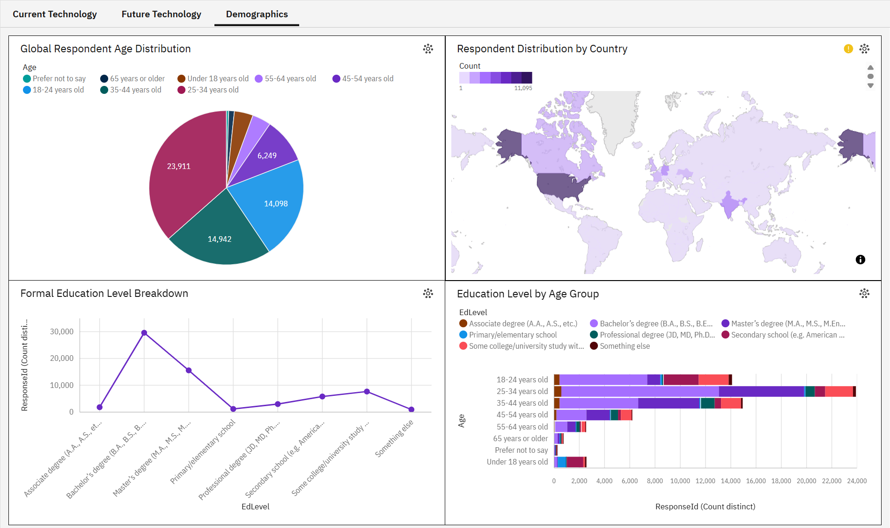

# Global Developer Ecosystem Trends 🌍
### IBM Data Analyst Capstone Project

   

## 📖 Executive Summary
This project analyzes the current state of the global engineering workforce using data from the **Stack Overflow Developer Survey**. The goal was to identify market standards, predict future technology trends, and determine the "optimal profile" for a high-value developer.

Using a cleaned dataset of professional developers, I utilized **Python** for data processing and **IBM Cognos Analytics** for dashboarding. The analysis synthesizes demographic shifts, technology adoption rates, and salary trajectories to provide actionable career insights.

---

## 📊 Dashboard Preview
*(A static export of the interactive IBM Cognos dashboard is available in the `03-Dashboard` folder)*

---

## ⚙️ Technical Methodology
This project required rigorous data cleaning to ensure integrity before analysis. The raw dataset contained semi-structured data and "hidden" duplicates that required custom handling strategies.

### 1. Advanced Data Cleaning
* **Duplicate Removal:** Standard duplication checks were insufficient. I implemented a logic check using unique identifiers to confirm and remove **20 duplicates**, ensuring data integrity without over-cleaning.
* **Feature Engineering:** Technology columns (e.g., "Python;SQL;Java") were stored as single strings. I built a custom "Split-and-Explode" pipeline to tokenize these values, allowing for accurate frequency analysis without inflating row counts.

### 2. Strategic Imputation
Instead of dropping rows with missing values, I applied context-aware imputation:
* **AI Adoption:** Used **K-Nearest Neighbors (KNN)** classification ($k=5$) to predict missing AI tool usage based on user similarity (WorkExp, Role).
* **Salary Data:** Explicitly chose **not** to impute missing salaries (40% of data) to avoid fabricating financial insights. Instead, I used IQR (Interquartile Range) to filter extreme outliers (e.g., >$50M USD).

---

## 🔍 Key Findings & Insights

### 1. The "Golden Triangle" of Skills
The analysis confirmed that **JavaScript, Python, and SQL** are the non-negotiable pillars of the modern tech stack.
* **Recommendation:** For entry-level roles, fluency in these three is the baseline requirement.
* **Database Trends:** While PostgreSQL leads the market, MongoDB has firmly established itself as the primary NoSQL alternative, suggesting a "Polyglot Persistence" standard.

### 2. The "Interest Gap" (Future Trends)
By comparing "Current Usage" vs. "Desired Usage," I identified technologies with high momentum:
* **TypeScript & Go:** Showed a significant positive gap (Future Demand > Current Usage), indicating a market shift toward type safety and high-performance microservices.
* **Redis:** High interest in caching layers suggests a move toward performance optimization over simple data storage.

### 3. Salary & Education Dynamics
* **Experience Curve:** Salary growth is steepest in the first **0-10 years**, after which it plateaus. This suggests senior-level income growth is driven by role changes (management) rather than tenure.
* **Education:** While a Bachelor's degree is standard, the data shows that skills-based hiring is prevalent, with minimal salary marginal gains for Master's degrees in pure dev roles.

---

## 📂 Repository Structure

| Folder | Content |
| :--- | :--- |
| **`01-Notebooks`** | Jupyter notebooks containing the Python code for cleaning, imputation (KNN), and visualization. |
| **`02-Reports`** | The final **Executive Presentation** and the consolidated **Technical Analysis Report** (PDFs). |
| **`03-Dashboard`** | Static exports of the **IBM Cognos** visualizations. |
| **`04-data`** | *(Contains raw data source link)* |

---

## 🛠️ Tools & Libraries Used
* **Data Processing:** Pandas, NumPy
* **Machine Learning:** Scikit-learn (KNN Imputer)
* **Visualization:** Matplotlib, Seaborn
* **BI Tool:** IBM Cognos Analytics

## 📝 Author
**Usaid Khan**\
*Data Analyst | Open to Opportunities*
[LinkedIn](https://www.linkedin.com/in/usaid7/)

